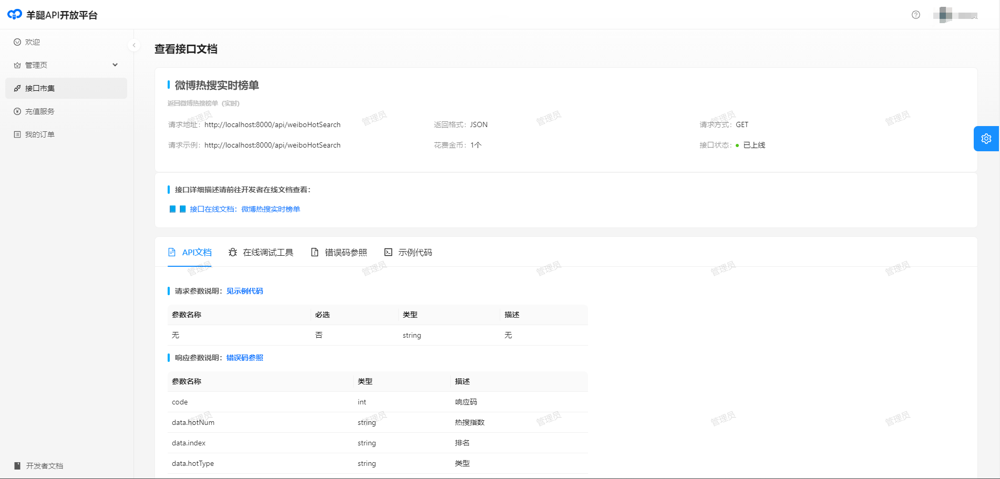

<p align="center">
  <a class="become-sponsor" href="https://doc.panyuwen.top/pages/793dcb/">快速使用</a>
</p>


<p align="center">
  </img>
</p>


<style>
.become-sponsor {
  padding: 8px 20px;
  display: inline-block;
  color: #11a8cd;
  border-radius: 30px;
  box-sizing: border-box;
  border: 1px solid #11a8cd;
}
</style>

<br/>
<p align="center">
    
    
    <a href="https://panyw-git.gitee.io/">
    
    </a>
  <a href="https://github.com/PanYW-Git/gigotapi-sdk" target="_blank"></a>
  <a href="https://github.com/PanYW-Git/gigotapi-sdk" target="_blank"></a>
</p>
<br/>

## 当前最新版本

```xml
<dependency>
    <groupId>top.panyuwen</groupId>
    <artifactId>gigotapi-sdk</artifactId>
    <version>0.0.4</version>
</dependency>
```


## ⚡ 反馈与交流

在使用过程中有任何问题和想法，请给我提 [Issue](https://github.com/PanYW-Git/gigotapi-doc/issues)。
你也可以在Issue查看别人提的问题和给出解决方案。

或者添加微信：

<table>
  <tbody>
    <tr>
      <td align="center" valign="middle">
        
        <p>PYW(技术交流,请添加我微信备注"API")</p>
      </td>
    </tr>
  </tbody>
</table>

<style>
  .page-wwads{
    width:100%!important;
    min-height: 0;
    margin: 0;
  }
  .page-wwads .wwads-img img{
    width:80px!important;
  }
  .page-wwads .wwads-poweredby{
    width: 40px;
    position: absolute;
    right: 25px;
    bottom: 3px;
  }
  .wwads-content .wwads-text, .page-wwads .wwads-text{
    height: 100%;
    padding-top: 5px;
    display: block;
  }
</style>

<p align="center">
  <a class="become-sponsor" href="/pages/1b12ed/">支持这个项目</a>
</p>